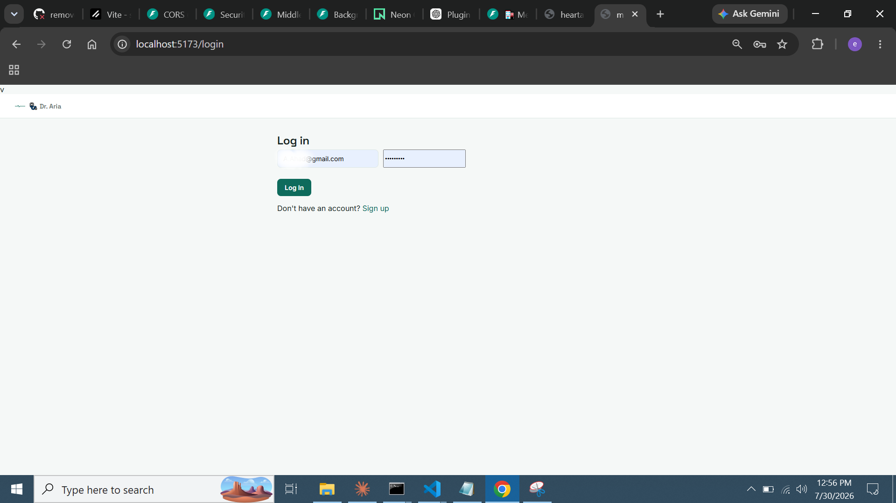
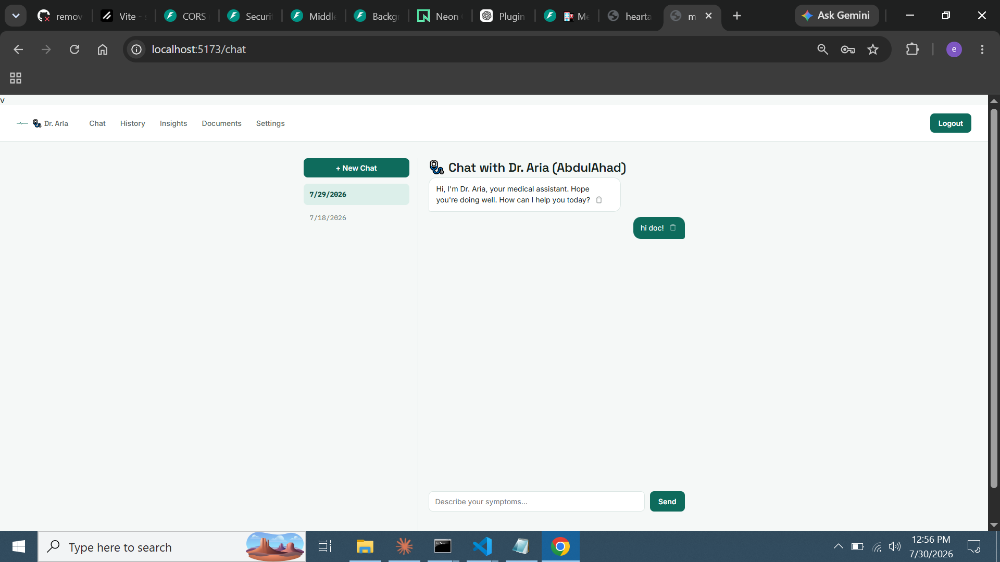
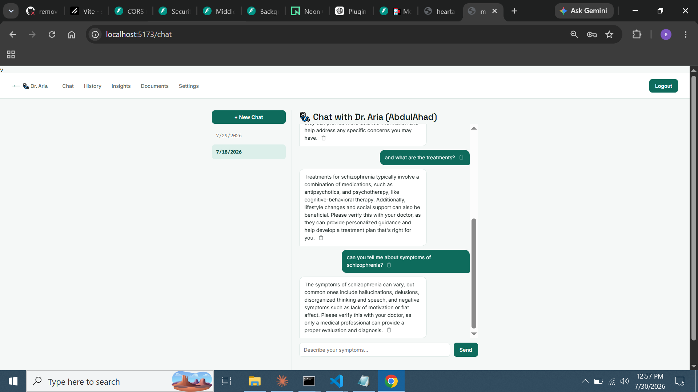
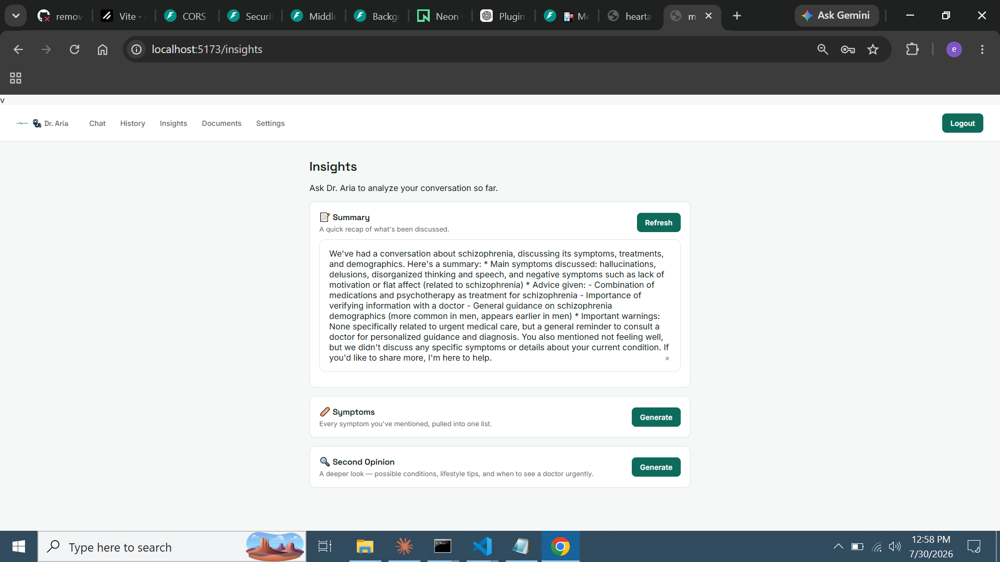
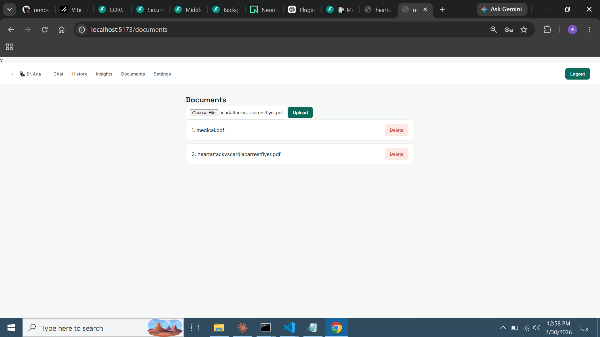
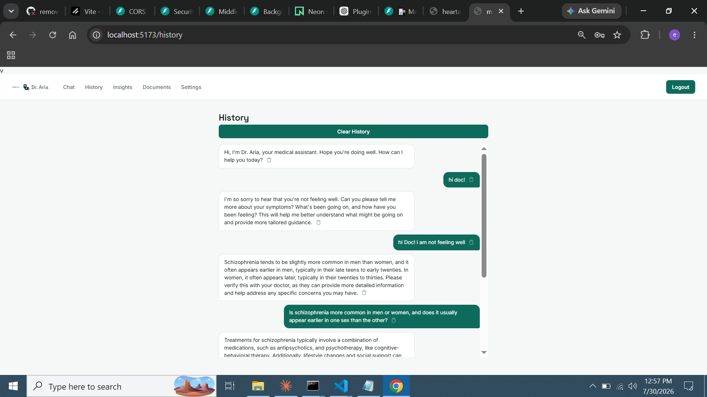
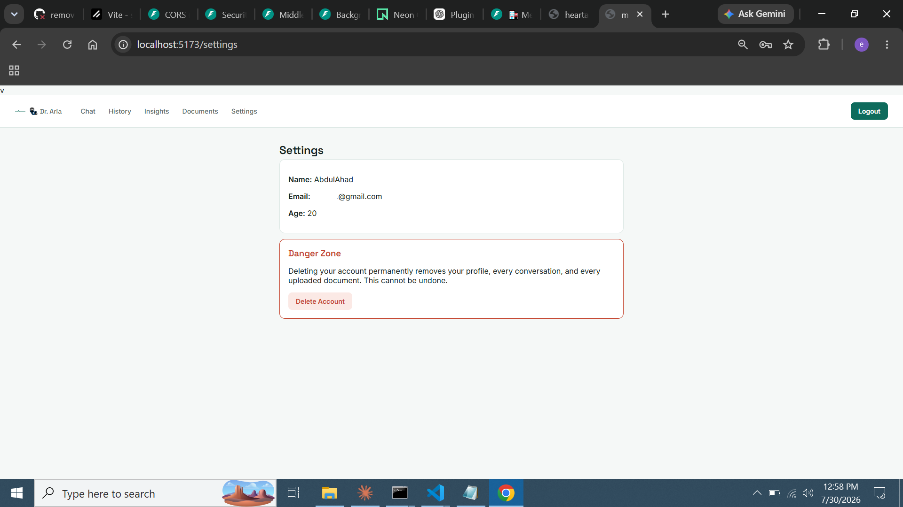

# 🏥 Medical Assistant Chatbot API * Dr. Aria 


> Meet **Dr. Aria** A warm, friendly AI medical assistant with authenticated, per-patient chat sessions, document-grounded answers (RAG), and AI-generated insights.

> ⚠️ *For informational purposes only. Always consult a real doctor for medical decisions.*

A React frontend for this API is available separately — see [medical-chatbot-frontend](https://github.com/mano877/medical-chatbot-frontend).

---

## 🎥 Demo


*Register → upload a medical PDF → ask Dr. Aria a question grounded in that document.*

---

## 📸 Screenshots

<p align="center">
  
  
</p>
<p align="center">
  
  
</p>
<p align="center">
  
  
</p>
<p align="center">
  
</p>

---

## ⚙️ Quick Setup with `uv`

```bash
git clone <https://github.com/mano877/medical_chatbot>
cd medical-chatbot

uv sync

cp .env.example .env
# Edit .env — see Environment Variables below

psql -U postgres -c "CREATE DATABASE medical_chatbot;"

uv run uvicorn app.main:app --reload --port 8000
```

Open **http://localhost:8000/docs** for the full interactive Swagger UI (supports pasting a Bearer token via the Authorize button for testing protected routes).

Running tests: `pytest tests/ -v` (uses an isolated test database see [docs/TESTING.md](docs/TESTING.md))

---

## 🔐 Authentication

1. `POST /users` — sign up
2. `POST /users/login` — log in, get `{ access_token, user_id }`
3. Pass the token on every request: `Authorization: Bearer <access_token>`

---

## 📡 Endpoints

### 👤 Users
| Method | Endpoint | Auth | Description |
|--------|----------|------|-------------|
| `POST` | `/users` | — | Register a new patient |
| `POST` | `/users/login` | — | Log in, get a JWT |
| `GET` | `/users/{user_id}` | 🔒 self | Get your own profile |
| `DELETE` | `/users/{user_id}` | 🔒 self | Delete your own account + all data |

### 💬 Chat & Conversations
| Method | Endpoint | Auth | Description |
|--------|----------|------|-------------|
| `POST` | `/chat` | 🔒 | Send a message — `{ "message": "...", "conversation_id": <id> }` |
| `POST` | `/conversations` | 🔒 | Start a new, separate conversation thread |
| `GET` | `/conversations` | 🔒 | List your conversations, newest first |
| `GET` | `/conversations/{id}/messages` | 🔒 | Get all messages in one conversation |
| `DELETE` | `/conversations/{id}` | 🔒 | Delete a conversation and all its messages |
| `DELETE` | `/messages/{message_id}` | 🔒 | Delete a single message |

`user_id` comes from the JWT token — never passed by the client. `conversation_id` is required and must belong to the authenticated user; use `POST /conversations` to create one first (e.g. for a "+ New Chat" button), then pass its `id` on every `/chat` call for that thread.

### 📜 History
| Method | Endpoint | Auth |
|--------|----------|------|
| `GET` | `/users/{user_id}/history` | 🔒 self |
| `DELETE` | `/users/{user_id}/history` | 🔒 self |

### 🧠 Smart Analysis
| Method | Endpoint | Auth | Description |
|--------|----------|------|-------------|
| `POST` | `/users/{user_id}/summarize` | 🔒 self | Summarize the conversation |
| `GET` | `/users/{user_id}/symptoms` | 🔒 self | Extract mentioned symptoms |
| `POST` | `/users/{user_id}/second-opinion` | 🔒 self | Deeper AI analysis |

### 📄 Documents (RAG)
| Method | Endpoint | Auth | Description |
|--------|----------|------|-------------|
| `POST` | `/documents/upload` | 🔒 | Upload a PDF — returns instantly, processes in the background |
| `GET` | `/documents` | 🔒 | List your documents, with `status` and `chunks` |
| `DELETE` | `/documents/{id}` | 🔒 | Delete your own document |

See [docs/ARCHITECTURE.md](docs/ARCHITECTURE.md) for the full RAG pipeline, database schema, and background processing details.

---

## 🔧 Environment Variables

| Variable | Description |
|----------|--------------|
| `DATABASE_URL` | PostgreSQL connection string |
| `GROQ_API_KEY` | Free key from console.groq.com |
| `GROQ_MODEL` | Default: `llama-3.3-70b-versatile` |
| `OLLAMA_BASE_URL` | Ollama server URL (used for embeddings) |
| `OLLAMA_MODEL` | Default: `llama3.1:latest` |
| `PINECONE_API_KEY` | Your Pinecone API key |
| `PINECONE_INDEX_NAME` | Default: `medical-chatbot` |
| `PINECONE_ENVIRONMENT` | Default: `us-east-1` |

Full details, including JWT settings: [docs/ARCHITECTURE.md](docs/ARCHITECTURE.md#environment-variables)

---

## 📖 More Docs

- [docs/ARCHITECTURE.md](docs/ARCHITECTURE.md) — RAG pipeline, database schema, background task design
- [docs/CHANGELOG.md](docs/CHANGELOG.md) — recent engineering changes and why they were made
- [docs/TESTING.md](docs/TESTING.md) — test setup and safety checks

---

## ⚠️ Disclaimer
Dr. Aria is for **informational purposes only**. It does not replace professional medical advice, diagnosis, or treatment. Always consult a qualified healthcare provider.